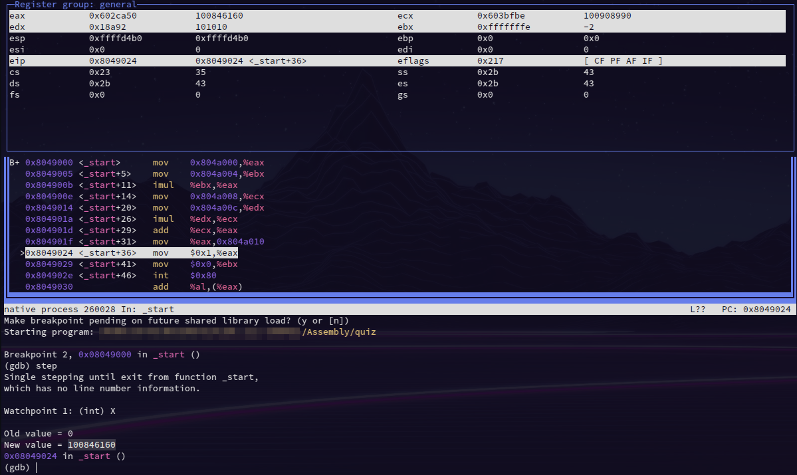

Student Name: León C. Ituarte

Date: 8 Jul 2024

Activity: Quiz 2

Class: CISC 211_60842

Variables:

    A =  31415                
    B =  -2                
    C =  999
    D =  101010

Expected output:

    X =  100846160

GDB output:

