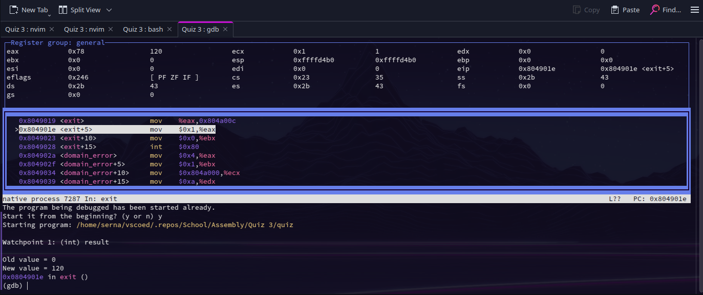
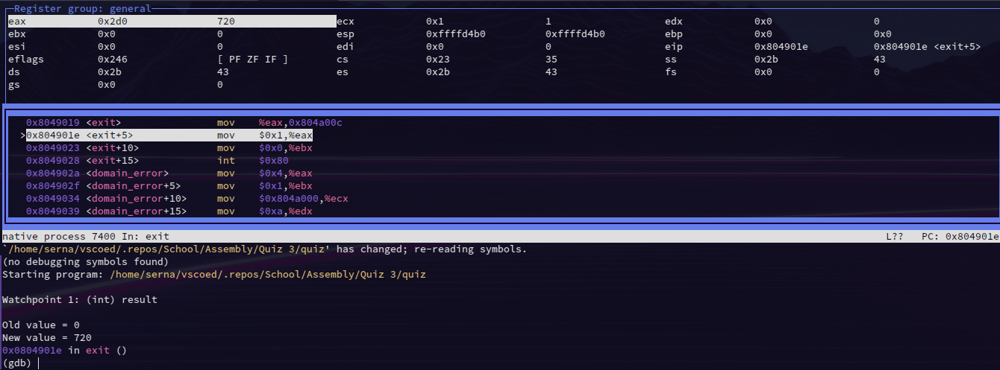
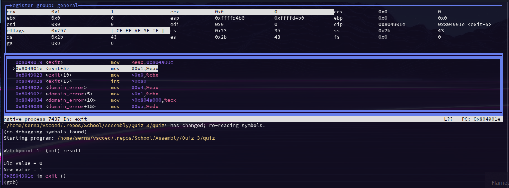
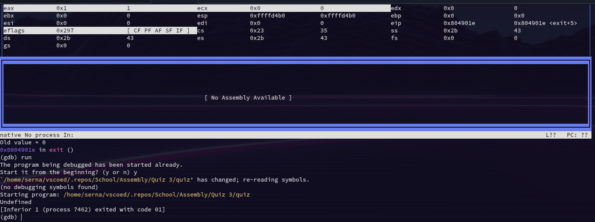

Student Name: León C. Ituarte

Date: 27 Jul 2024

Activity: Quiz 3

Class: CISC 211_60842

Factorials to be calculated:

    5! = 120
    6! = 720
    0! = 1
    -1! = undefined

GDB output:

5!

6!

0!

-1! (undefined)

